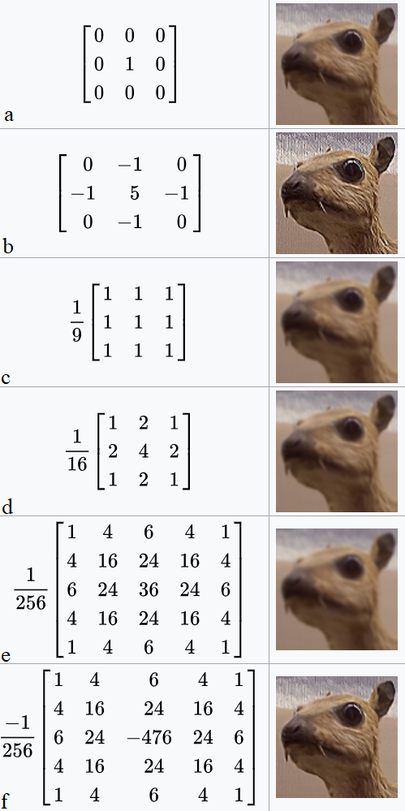
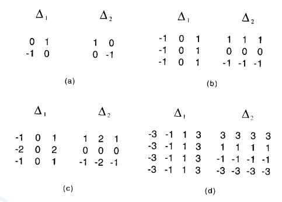

Table of Contents:

- [Introduction](#intro)
- [Adaptive Non-Maximal Suppression](#anms)
- [Feature Descriptor](#feat-descriptor)
- [Feature Matching](#feat-matching)
- [RANSAC to estimate Robust Homography](#homography)
- [Cylinderical Projection](#cyl-projection)
- [Blending Images](#blending)
- [Discussion](#discussion)

## 1. Introduction

Now that we have learned about a few building blocks of computer vision from [link: Pano Part 1], let us try to do something cool with it! The purpose of this project is to stitch two or more images in order to create one seamless panorama image. Each image should have few repeated local features ($$\sim 30-50\%$$ or more, emperically chosen). In this project, you need to capture multiple such images. Note that your camera motion should be limited to purely translational or purely rotational around the camera center. The following method of stitching images should work for most image sets but you'll need to be creative for working on harder image sets. 

  
  
 Fig. 1: Image Set for Panorama Stitching: Delicate Arch (at Arches National Park, Utah) 
 
  
  
 Fig. 2: Panorama image of the Delicate Arch 

For this project, let us consider a set of sample images with much stronger corners as shown in the Fig. 3.  

  
  
 Fig. 3: Sample image set for panorama stitching 

## 2. Adaptive Non-Maximal Suppression (or ANMS)
The objective of this step is to detect corners such that they are equally distributed across the image in order to avoid weird artifacts in warping. Corners in the image can be detected using `cornermetric` function with the appropriate parameters. The output is a matrix of corner scores: the higher the score, the higher the probability of that pixel being a corner. <i> Try to visualize the output using the Matlab function </i>`imagesc` or `surf`.

To find particular strong corners that are spread across the image, first we need to find $$N$$strong corners. Feel free to use MATLAB function `imregionalmax`. Because, when you take a real image, the corner is never perfectly sharp, each corner might get a lot of hits out of the $$N$$ strong corners - we want to choose only the $$N$$best best corners after ANMS. In essence, you will get a lot more corners than you should! ANMS will try to find corners which are local maxima.

  

Fig 4. shows the output after ANMS. Clearly, the corners are spread across the image. To plot these dots over the image in MATLAB, do: $$\texttt{imshow(..); hold on; plot(...); hold off;}$$

  
  
 Fig. 4: Output of ANMS on first 2 images. 

## 3. Feature Descriptor
In the previous step, you found the feature points (locations of the N best best corners after ANMS are called the feature points). You need to describe each feature point by a feature vector, this is like encoding the information at each feature points by a vector. One of the easiest feature descriptor is described next.

Take a patch of size $$40 \times 40$$ centered <b>(this is very important)</b> around the keypoint. Now apply gaussian blur (feel free to play around with the parameters, for a start you can use Matlab’s default parameters in `fspecial` command, Yes! you are allowed to use `fspecial` command in this project). Now, sub-sample the blurred output (this reduces the dimension) to $$8 \times 8$$. Then reshape to obtain a $$64 \times 1$$ vector. Standardize the vector to have zero mean and variance of 1 <i>(This can be done by subtracting all values by mean and then dividing by the standard deviation)</i>. Standardization is used to remove bias and some illumination effect.

## 4. Feature Matching
In the previous step, you encoded each keypoint by $$64\times1$$ feature vector. Now, you want to match the feature points among the two images you want to stitch together. In computer vision terms, this step is called as finding feature correspondences within the 2 images. Pick a point in image 1, compute sum of square difference between all points in image 2. Take the ratio of best match (lowest distance) to the second best match (second lowest distance) and if this is below some ratio keep the matched pair or reject it. Repeat this for all points in image 1. You will be left with only the comfident feature correspondences and these points will be used to estimate the transformation between the 2 images also called as <a href="pano-prereq#homography">_Homography_</a>. Use the function `dispMatchedFeatures` given to you to visualize feature correspondences. Fig. 5 shows a sample output of `disMatchedFeatures` on the first two images.

  
  
 Fig. 5: Output of \(\texttt{dispMatchedFeatures}\) on first 2 images. 

## 5. RANSAC to estimate Robust Homography
We now have matched all the features correspondences but not all matches will be right. To remove incorrect matches, we will use a robust method called <i>Random Sampling Concensus</i> or <b>RANSAC</b> to compute homography.

Recall the RANSAC steps are: 
1. Select four feature pairs (at random), $$p_i$$ from image 1, $$p_i^1$$ from image 2.
2. Compute homography $$H$$ (exact). Use the function `est_homography` that will be provided to you. Check Panorama assignment!
3. Compute inliers where $$SSD(p_i^1, Hp_i) < \texttt{thresh}$$. Here, $$Hp_i$$ computed using the $$\texttt{apply_homography}$$ function given to you.
4. Repeat the last three steps until you have exhausted $$N$$max number of iterations (specified by user) or you found more than percentage of inliers (Say $$90\%$$ for example).
5. Keep largest set of inliers.
6. Re-compute least-squares $$\hat{H}$$ estimate on all of the inliers. Use the function `est_homography` given to you.

## 6. Cylinderical Projection
When we are try to stitch a lot of images with translation, a simple projective transformation (homography) will produce substandard results and the images will be strectched/shrunken to a large extent over the edges. Fig. 6 below highlights the stitching with bad distortion at the edges. 

  
  
 Fig. 6: Panorama stitched using projective transform showing bad distortion at edges. 

To overcome such distortion problem at the edges, we will be using cylinderical projection on the images first before performing other operations. Essentially, this is a pre-processing step. The following equations transform between normal image co-ordinates and cylinderical co-ordinates: 

$$x' = f \cdot tan \left(\cfrac{x-x_c}{f}\right)+x_c$$

$$y' = \left( \cfrac{y-y_c}{cos\left(\cfrac{x-x_c}{f}\right)}\right)+y_c$$

In the above equations, $$f$$ is the focal length of the lens in pixels (feel free to experiment with values, generally values range from 100 to 500, however this totally depends on the camera and can lie outside this range). The original image co-ordinates are $$(x, y)$$ and the transformed image co-ordinates (in cylindrical co-ordinates) are $$(x' ,y')$$. $$x_c$$ and $$y_c$$ are the image center co-ordinates. Note that, $$x$$ is the column number and $$y$$ is the row number in  $$\scshape{First}$$.

<b>Note:</b> Use `meshgrid`, `ind2sub`, `sub2ind` to speed up this part. <b>Using loops will TAKE FOREVER!</b>

## 7. Blending Images:
### A. Poisson Blending

## 8. Discussion

## 6. Transformation:
- Homogenous Coordinates
- Projective Geometry
- Projective Transformation
- Affine Tranformation
- Vanishing Points
- Homography
- Deep learning, CNN and Deep Homography
- Single View Geometry

## 7. Panorama Stitching:
- ANMS
- Feature Correspondence
- Homography
- Make it robust using RANSAC
- Cylindrical Projection
- Blending images (Laplacian Pyramid)
- 

## -----------------------------------------------------

## 1. Introduction:

## 2. - Features and Convolution:
- What are features?
- Ever heard of Convolutional Neural Networks?
- 1D Conv
- 2D and 3D Conv
- Conv in images
- Kernels
- Deconvolution
- Optional read [Fourier Transform]

## 3. Filtering:
- Point operators
- Filtering (`imfilter` and `imgaussfilt`) (MEAN, MEDIAN filters)
- Sobel, Prewitt filtering (- Derivates in images)
- Padding in images (`paddarray`)
- Erosion and Dilation (`imerode` and `imdilate`)
- Denoising

## 4. Types of Features:

- Edge: Sobel, Prewitt, Roberts, Canny and `approxcanny`
- Corner: Harris, Shi Tomasi, FAST
- Blob detection: LoG, DoG
- Descriptor: SIFT (Scale selectivity (CIS 580) Multi-scale concepts), SURF and HOG

## Features and Convolution:
### 2.1 What are features?
What are <i>features</i> for Machine vision? <i> Is it similar as Human visual perception? This question can have different answers but one thing is certain that feature detection is an imperative building block for a variety of computer vision applications. We all have seen <i> Panorama Stitching </i> in our smartphones or other softwares like Adobe Photoshop or AutoPano Pro. The fundamental idea in such softwares is to align two or more images before seamlessly stitching into a panorama image. Now back to the question, <i> what kind of features should be detected before the alignment? </i> Can you think of a few types of features?

A set of particular position in the images like building corners or mountain peaks can be considered as features. These kinds of localized features are known as <i>corners</i> or keypoints or interest points and are widely used in different applications. These are characterized by the appearance of neigborhood pixels surrounding the point (or local patches). The other kind of feature is based on the orientation and local appearance and is generally of a good indicator of object boundaries and occlusion events. <i> Occlusion means that there is something in the field of view of the camera but due to some sensor/optical property or some other scenario, you can't.</i> 

There are multiple ways to detect certain features. One of them is convolution. <i> What is convolution? It is really 'convoluted'? </i> Before we really understand what convolution really means, think it as an operation of changing the pixel values to a new set of values based on the values of the nearby pixels. <i> Didn't get the gist of it? Don't worry! </i>

Convolution is an operation between two functions, resulting in the another function that depicts how the shape of first function is modified by the second function. The convolution of two functions, say $$f$$ and $$g$$ is written is $$f\star g$$ or $$f*g$$ and is defined as:
$$
(f*g)(t) = \int_{-\infty}^{\infty} f(\tau)g(t-\tau)d\tau = \int_{-\infty}^{\infty} f(t-\tau)g(\tau)d\tau
$$

The following image depcits the convolution <i>(in black)</i> of the two functions <i>(red and green).</i> One can think convolution as the common under (between $f$ and $g$) 

Let's try to visualize convolution in one dimension. The following image depcits the convolution <i>(in black)</i> of the two functions <i>(red and green).</i> One can think convolution as the common area under the functions  $$f$$ and $$g$$.

  
  
A cartoon drawing of a biological neuron (left) and its mathematical model (right).

Since we would be dealing with discrete functions in this course, let us look at a simple discrete 1D example:
$$f = [10, 50, 60, 10, 20, 40, 30]$$ and 
$$g = [1/3, 1/3, 1/3]$$
Let the output be denoted by $$h$$. What would be the value of $$h(3)$$? In order to compute this, we slide $$g$$ so that it is centered around $$f(3)$$ _i.e._
$$\begin{bmatrix}10 & 50 & 60 & 10 & 20 & 40 & 30\\0 & 1/3 & 1/3 & 1/3 & 0 & 0 & 0\end{bmatrix}$$
We multiply the corresponding values of $$f$$ and $$g$$ and then add up the products _i.e._
$$h(3)=\dfrac{1}{3}50+\dfrac{1}{3}60\dfrac{1}{3}10=40$$
Again, it can be infered that the function $$g$$ (also known as kernel operator or the filter) is computing a windowed average of the image.

Similarly, one can compute 2D convolutions (and hence any $$N$$ dimensions convolution) as shown in image below:

  
  
A cartoon drawing of a biological neuron (left) and its mathematical model (right).

These convolutions are the most commonly used operations for smoothing and sharpening tasks. Look at the example down below:

  
  
A cartoon drawing of a biological neuron (left) and its mathematical model (right).

Different kernels (or convolution masks) can be used to perform different level of sharpness:

  
  
(a). Convolution with an identity masks results the same image as the input image. (b). Sharpening the image. (c). Normalization (or box blur). (d). 3X3 Gaussian blur. (e). 5X5 Gaussian blur. (f). 5X5 unsharp mask, it is based on the gaussian blur. NOTE: The denominator outside all the matrices are used to normalize the operation.

Apart from the smoothness operations, convolutions can be used to detect features such as edges as well. Figure **[Number]** shows ....

  
  
Detecting edges in an image with different kernels.

### Deconvolution:

Clearly as the name suggests, deconvolution is simply a process that reverses the effects of convolution on the given information. Deconvolution is generally implemented by computing the _Fourier Transform_ of the signal $$h$$ and the transfer function $$g$$ (where $$h=f * g$$). In frequency domain, (assuming no noise) we can say that:
$$F=H/G$$
[Optional Read: Fourier Transformation](Link goes here)
One can perform deblurring and restoration tasks using deconvolution as shown in figure:

  
  
Left half of the image represents the input image. Right half represents the image after deconvolution.

Now, since we have learned the basic fundamentals about convolution and deconvolution, let's dig deep into _Kernels_ or _point operators_). One can apply small convolution filters of size $$2\times2$$ or $$3\times3$$ or so on. These can be _Sobel, Roberts, Prewitt, Laplacian_ operators etc. Operators like these are a good approximation of the derivates in an image. Though, for a better approximation of derivatives, larger masks like _Gaussian_ or _Gabor_ filters are used.
But what does it mean to take the derivative of an image? The derivative or the gradient of an image is defined as: 
$$\nebula f=\left[\dfrac{\delta f}{\delta x}, \dfrac{\delta f}{\delta y}\right]$$
It is important to note that the gradient of an image points towards the direction in which the intensity changes at the highest rate and thus the direction is given by:
$$\theta=tan^{-1}\left(\dfrac{\delta f}{\delta y}\Bigg{/}\dfrac{\delta f}{\delta x}\right)$$
Moreover, the gradient direction is always perpendicular to the edge and the edge strength can by given by:
$$||\nebula f|| = \sqrt{\left(\dfrac{\delta f}{\delta x}\right)^2 + \left(\dfrac{\delta f}{\delta y}\right)^2}$$\In practice, the partial derivatives can by written as discrete gradients as the different of values between consecutive pixels _i.e._ $$f(x+1,y) -  f(x,y)$$ as $$\delta x$$  and  $$f(x,y+1) -  f(x,y)$$ as $$\delta y$$.

Figure below shows commonly used gradient operators. 

  
  
Left half of the image represents the input image. Right half represents the image after deconvolution.

You can implement the following the `MATLAB` using the function `edge` with various methods for edge detection.

[Kernels (known as point operators): Sobel (derivatives in images) and Prewitt]
[Filtering] imfilt and imgauss
[Padding]
[Erode and dilate]
[Denoise]
[Back to features...we already studied about sobel and prewitt edge detectors]
[Adaptive edge detectors: Canny and approxCanny]
[Corners]
[Blob: LoG and Dog]
[Feature Descriptor: SIFT (Scale selectivity (CIS 580) Multi-scale concepts), SURF and HOG]

## Camera Optics
We learned about ISO, shutter speed, apertures and focal length in the [Color Segmentation](https://cmsc426.github.io/colorseg/#colimaging) project. Let us now learn about how the camera system work! We have learned that smaller the Field Of View (FOV), larger the focal length (f) is. One can say:
$$FOV = tan^{-1}\left(\dfrac{d}{2f}\right)$$
where $$d$$ is sensor size. Figure [focal length] shows the effect of focal length to the FOV. And clearly, larger the focal length, the more _zoomed-in_ image is captured. Also, large focal length compresses the depth. Fig [imagesatdifferentF] and [depth-of-field] illustrates images captured at different focal length and their effects.

Lens distortion....

[Camera Model]
- Pinhole model
- Intrinsic Calibration $$K$$ Matrix
- Distortion and lens correction
- Extrinsic calibration (couple of lines)

[Transformation]

## Transformations:
- At an elementary level, geometry is the study of points and lines and their relationships. 
- A point in the plane can be represented as a pair of coordinates $$(x,y)$$ in $$\mathbb{R}^2$$ (Remember Math module: Hilbert space). 
- Points and lines: A line in any plane can be represented as: $$ax+by+c=0$$ where $$a,b,c\in\mathbb{R}$$. This line can also be represented as a vector $$(a,b,c)^T$$. It is important to note that the vector can be of any scale $$\lambda$$ _i.e._ the line can be written as a vector $$\lambda(a,b,c)^T$$ $$\ \ \forall \lambda\in\mathbb{R}-\{0\}$$. A set of such vectors with different values of $$k$$ forms an equivalence class of vectors and are known as homogenous vectors or homogenous coordinates.
- 3D point projection (Metric Space): The real world point $$(X,Y,Z)$$ is projected on the image plane as 

  
  
  
A cartoon drawing of a biological neuron (left) and its mathematical model (right).

- Homogenous Coordinates
- Projective Geometry
- Projective Transformation
- Affine Tranformation
- Vanishing Points
- Homography
- Deep learning, CNN and Deep Homography
- Single View Geometry

[Panorama Stitching:]
- ANMS
- Feature Correspondence
- Homography
- Make it robust using RANSAC
- Cylindrical Projection
- Blending images (Laplacian Pyramid)

## Transformations:
- At an elementary level, geometry is the study of points and lines and their relationships. 
- A point in the plane can be represented as a pair of coordinates $$(x,y)$$ in $$\mathbb{R}^2$$ (Remember Math module: Hilbert space). 
- Points and lines: A line in any plane can be represented as: $$ax+by+c=0$$ where $$a,b,c\in\mathbb{R}$$. This line can also be represented as a vector $$(a,b,c)^T$$. It is important to note that the vector can be of any scale $$\lambda$$ _i.e._ the line can be written as a vector $$\lambda(a,b,c)^T$$ $$\ \ \forall \lambda\in\mathbb{R}-\{0\}$$. A set of such vectors with different values of $$k$$ forms an equivalence class of vectors and are known as homogenous vectors or homogenous coordinates.
- 3D point projection (Metric Space): The real world point $$(X,Y,Z)$$ is projected on the image plane as 

